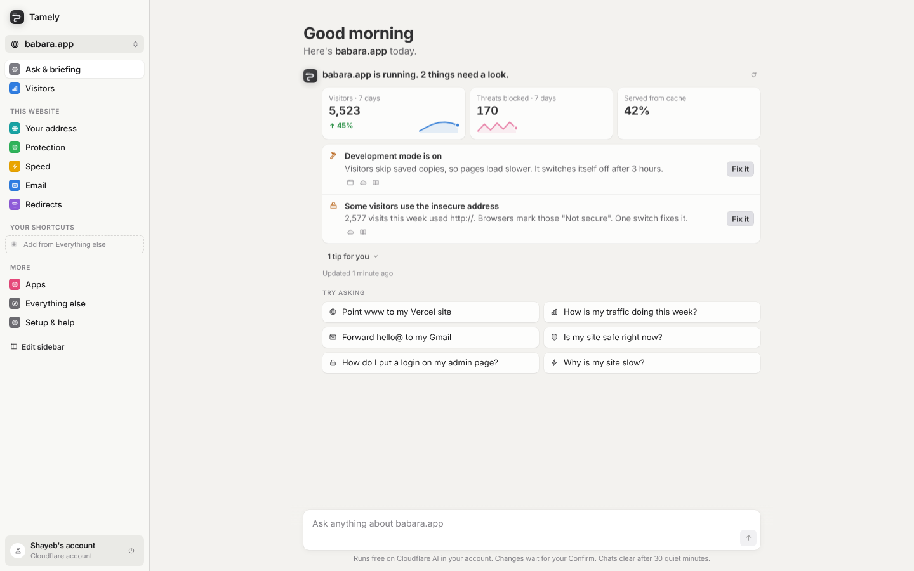
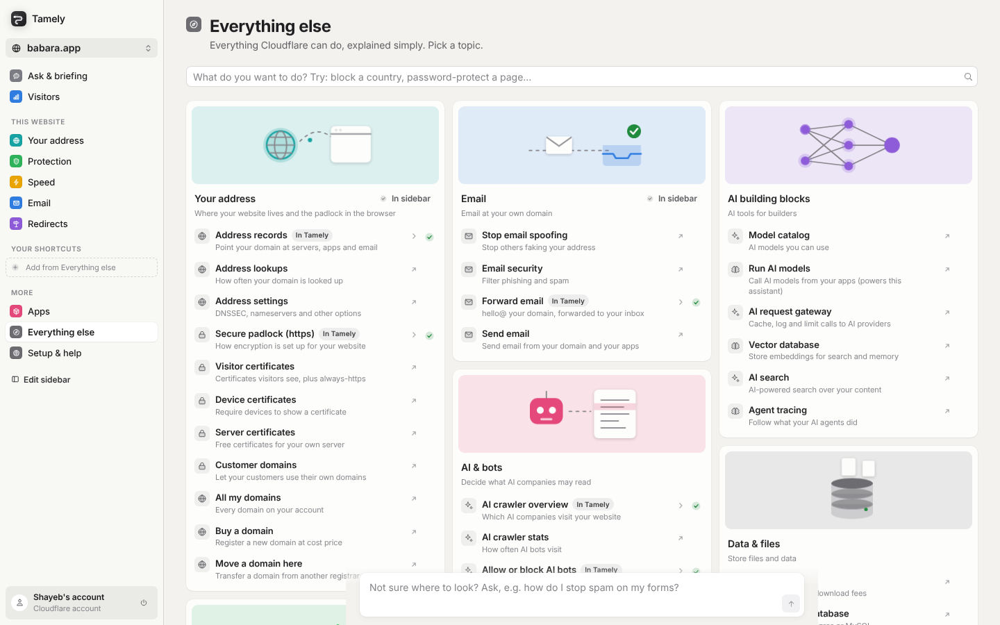
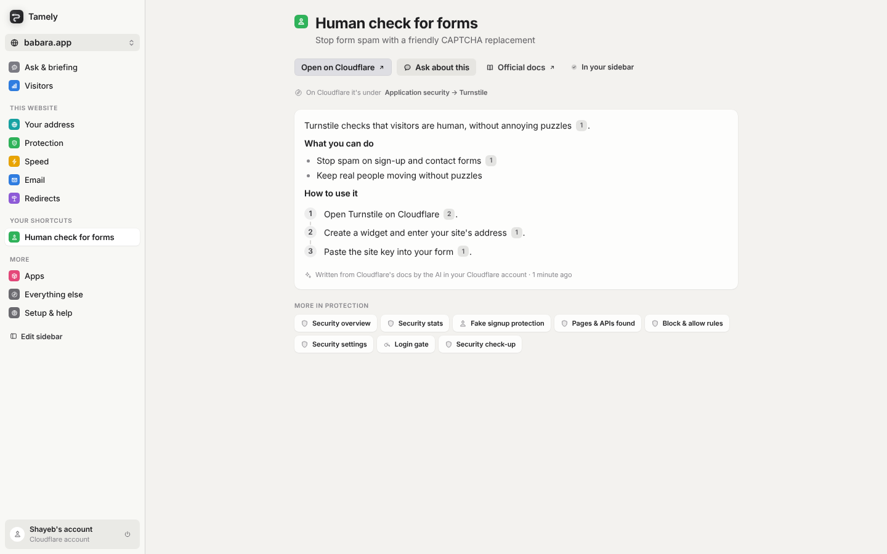

# Tamely

> **This is an illustration: a working example of how I'd fix Cloudflare's dashboard.**
> It's an independent concept project by [shayeb](https://x.com/m7moudshaye), not a Cloudflare product, and isn't made or endorsed by Cloudflare, Inc.

Cloudflare can do almost anything, but its dashboard is a maze: hundreds of pages, product names instead of plain words, and settings buried three menus deep. Tamely is the same Cloudflare, redesigned for people who just want their website to work:

- **Ask in plain words.** "Point www to my Vercel site." The assistant looks things up, shows each step, cites its sources, and prepares the change as a card you confirm. It never changes anything on its own.
- **A daily briefing.** What needs a look today, with one-tap fixes.
- **Everything else, explained.** Every Cloudflare dashboard page renamed in plain words, with a short guide written from the official docs.
- **A sidebar you shape.** Add, remove and reorder links; ask the assistant to do it for you.
- **Costs nothing to run.** The AI is Workers AI on *your own* Cloudflare account (free daily allowance), and the server stores nothing about you.

Live demo: **[tamely.dev](https://tamely.dev)**

| Ask & briefing | Everything else | A plain-words guide |
|---|---|---|
|  |  |  |

## Layout

```
shared/   Code both sides use: types, the plain-words catalog of every dashboard page, glossary, token template, routes
be/       Cloudflare Worker (Hono). API under /api/v1, split by feature
fe/       Astro site + React app. src/ui is the design system (tokens, icons, components, charts)
e2e/      Playwright end-to-end tests against the real Worker and a mock Cloudflare API
```

Backend features (`be/src/features`): session, sites, dns, email, redirects, protection, speed, analytics, apps, actions (every change, signed proposals), briefing (rule-based, no AI), assistant (Workers AI tool loop, SSE, citations), setup (onboarding checks).

Frontend features (`fe/src/features`): landing, connect (guided onboarding), shell, home (chat + briefing), chat, briefing, visitors, address, protection, speed, email, redirects, apps, explore, setup.

## Run it

```bash
yarn install
cp be/.dev.vars.example be/.dev.vars   # set SESSION_SECRET (openssl rand -base64 48)
yarn dev                               # builds the site, then serves everything on http://127.0.0.1:8877
```

For live UI editing, run `yarn dev:be` and `yarn dev:fe` together and open http://localhost:4321 (the Astro dev server proxies `/api` to the Worker).

## Deploy

**From GitHub (Cloudflare Workers Builds):** Workers & Pages → Create → Import a repository, then:

| Setting | Value |
|---|---|
| Root directory | `be` |
| Build command | `cd .. && yarn install --frozen-lockfile && yarn build:fe` |
| Deploy command | `npx wrangler deploy --domain tamely.dev --domain www.tamely.dev` |
| Build variable | `PLAYWRIGHT_SKIP_BROWSER_DOWNLOAD=1` |
| Secret (Settings → Variables and Secrets) | `SESSION_SECRET`: output of `openssl rand -base64 48` |

**From your machine:** `npx wrangler login`, `npx wrangler secret put SESSION_SECRET`, then `yarn deploy` (it runs `wrangler deploy --domain tamely.dev`).

Using another domain? Change `--domain` in `be/package.json` and build with `PUBLIC_SITE_URL=https://your-domain`. The domain isn't in `wrangler.jsonc` on purpose: a route there makes local dev act as the real domain and breaks sign-in.

The design rules live in `fe/src/ui/DESIGN.md`.

## Sign in with Cloudflare

The button appears once a Cloudflare "OAuth client" exists. Until then, people connect with a key.

**One command (recommended):**

```sh
yarn oauth:setup
```

It opens Cloudflare with a one-time setup key already filled in (permission: OAuth Clients · Edit), creates the client, and saves `OAUTH_CLIENT_ID` and `OAUTH_CLIENT_SECRET` to `be/.dev.vars` without printing the secret. It can also send both to your deployed Worker. Delete the setup key afterwards.

**By hand** (Cloudflare dashboard → Manage Account → OAuth clients → Create):

| Field | Value |
|---|---|
| Client Name | Tamely |
| Response Type | Code |
| Grant type | Authorization Code **and** Refresh Token |
| Token Authentication Method | Client Secret POST |
| Redirect (Callback) URLs | `https://<your-domain>/api/v1/auth/cloudflare/callback`, `http://127.0.0.1:4321/api/v1/auth/cloudflare/callback`, `http://127.0.0.1:8877/api/v1/auth/cloudflare/callback` |
| Client URL | `https://<your-domain>` |
| Allowed CORS Origins | leave empty (the server talks to Cloudflare, not the browser) |
| Scopes | offline_access, account-settings.read, workers-scripts.read, ai.read, ai.write, zone.read, dns.write, zone-settings.write, cache.purge, analytics.read, bot-management.write, email-routing-address.write, email-routing-rule.write, dynamic-redirect.write |

Copy the client secret right away (Cloudflare shows it once), then:
- Local: put `OAUTH_CLIENT_ID` and `OAUTH_CLIENT_SECRET` in `be/.dev.vars` and open the app at `http://127.0.0.1:4321` (Cloudflare accepts loopback IPs; `localhost` is moved to 127.0.0.1 automatically).
- Production: `npx wrangler secret put OAUTH_CLIENT_ID` and `npx wrangler secret put OAUTH_CLIENT_SECRET`.

New clients are private: only members of your account can sign in. To open it to everyone, add a logo and Client URL, then verify your domain with the TXT record Cloudflare shows.

## The token people create

The connect screen opens Cloudflare's "Create token" page with all 13 permissions already filled in (built in `shared/src/token`). Nobody has to pick permissions by hand. After connecting, the setup check tries each feature and shows a fix link for anything missing.

## Safety

- The server stores nothing. The Cloudflare key (or sign-in) lives only in an AES-GCM sealed, `HttpOnly; Secure; SameSite=Strict` cookie that ends after 7 days without use; the age is checked inside the sealed value.
- "Sign out everywhere" sends you to Cloudflare to delete the key or revoke Tamely, which cuts off every device.
- Strict security headers: a hash-based Content-Security-Policy (no inline scripts allowed), HSTS, no framing, no CORS.
- Rate limits per visitor (sign-in 10/min, AI 20/min, API 300/min) and a 64 KB request cap.
- Every website id is checked against the user's own account before any read or change.
- The assistant can only propose. Proposals are HMAC-signed, tied to the account, and expire after 15 minutes.
- Writes need a same-origin custom header (CSRF guard). All input is validated before it reaches Cloudflare, so rule expressions can't be injected.
- Answers only link to sources the assistant actually looked up; any other link is shown as plain text. AI text is rendered as plain React elements, never raw HTML.
- Chat history and guides stay in your browser tab for 30 minutes at most, and are wiped on sign-out.
- `yarn audit`: 0 known vulnerabilities. `e2e/tests/15-hardening.spec.ts` attacks the running app (forged, oversized and flooding requests, CSP violations).

## Tests

```bash
npx playwright install chromium   # once
yarn test:e2e
```

Runs the real Worker against a mock Cloudflare API (REST, GraphQL and Workers AI) in `e2e/mock`. Output in `e2e/artifacts`: an HTML report (`report/index.html`), `results.json`, and a screenshot of every step (`screens/`).
